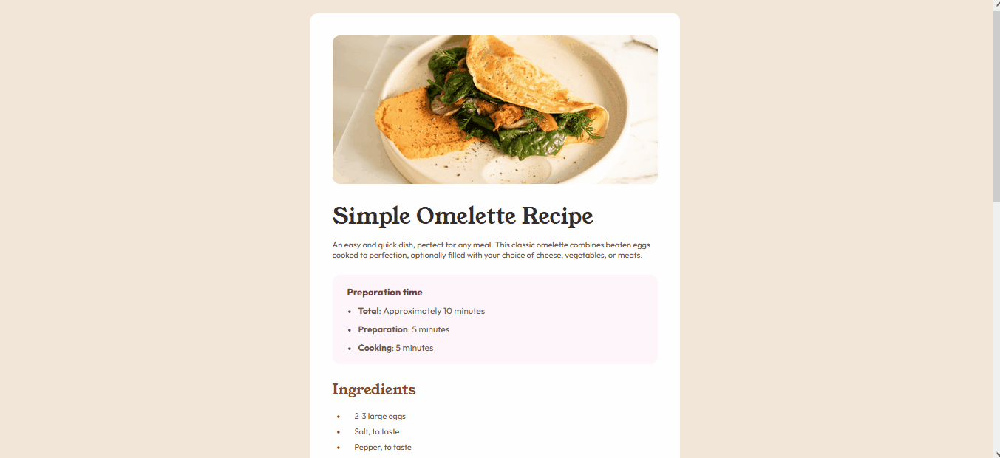

<h1 align="center">Recipe Page Main</h1>

  Projeto do Front-End Mentor para praticar conhecimentos em HTML e CSS.

  

 

## 🚀 Tecnologias

Esse projeto foi desenvolvido com as seguintes tecnologias:

- HTML e CSS
- Git Github

## 💻 Projeto

Recipe Page Main é uma página de receita onde você pode colocar/fazer a sua receita deliciosa.

Vai um miojo aí?

## Como ficou o projeto online

  

  
<a href="https://recipe-page-main-frontend-mentor-zeta.vercel.app/" target="_blank">Clique para</a> acessar o link</a>
  

## Conclusão

Falta coordenação na hora de colocar as propriedades de margin e padding.